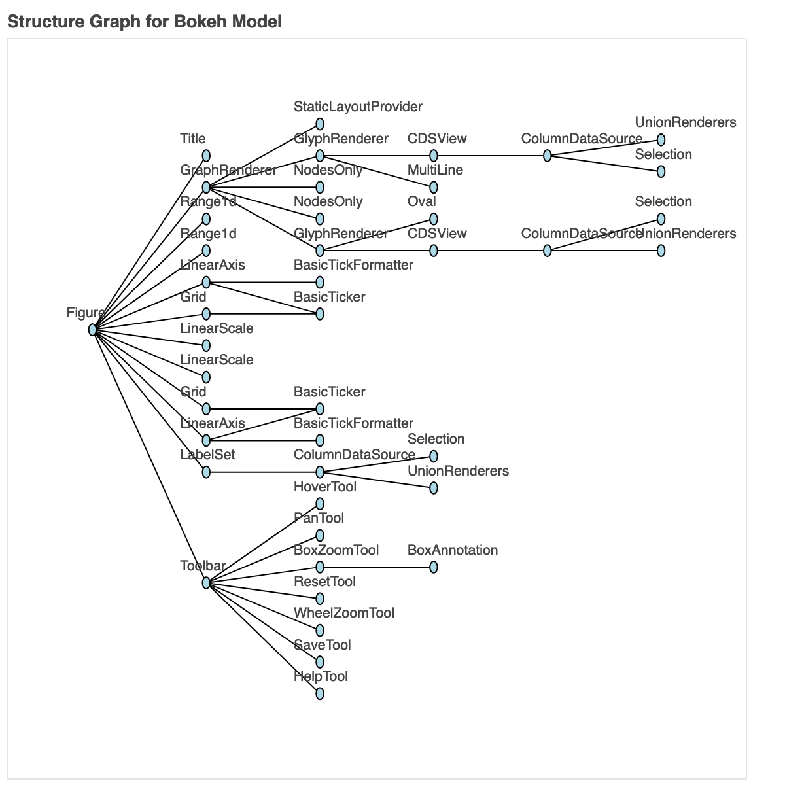
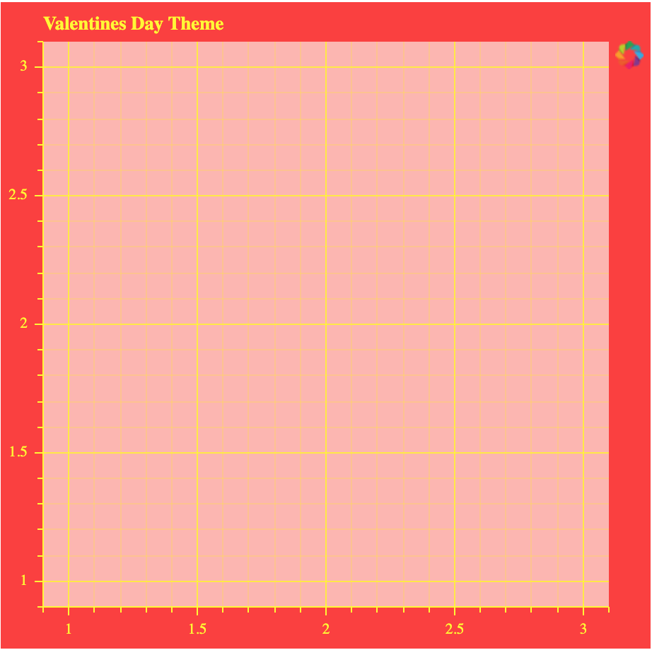

## BokehThemeBuilder

<table>
<tr><td></td><td></td></tr>
</table>

[bokeh](http://bokeh.org) is a library for generating interactive graphics and dashboards in python. 
Every component offers a myriad of customizing options, and I find it impossible to keep track of them.
This tool (very much under development) offers a graphical interface to those options. I imagine the user
working with this tool to prepare a plot format that they like, and then obtaining code from the tool
that they can include in whatever bokeh project they are working on.

As your theme evolves, the page will show yaml code to the right of your plot. 
You can copy this yaml into a file to create a bokeh theme. [This blog post](https://blog.bokeh.org/posts/styling-bokeh)
explains how to use the theme file to style your plots.

This [valentines theme](themes/valentines.yaml) is an example created by this tool:

<center>

</center>

The main.py file is a bokeh server app that loads the widgets.py and options.py modules.  You run it like this:
```
$ bokeh serve .
```
and navigate in your browser to localhost port 5006.

You can also try it directly from heroku by going to [the heroku app page](http://bokehmodelbuilder.herokuapp.com).

The utils directory includes some tools for working with this setup including code for producing the graphical display
of models as in the image on the right above.


