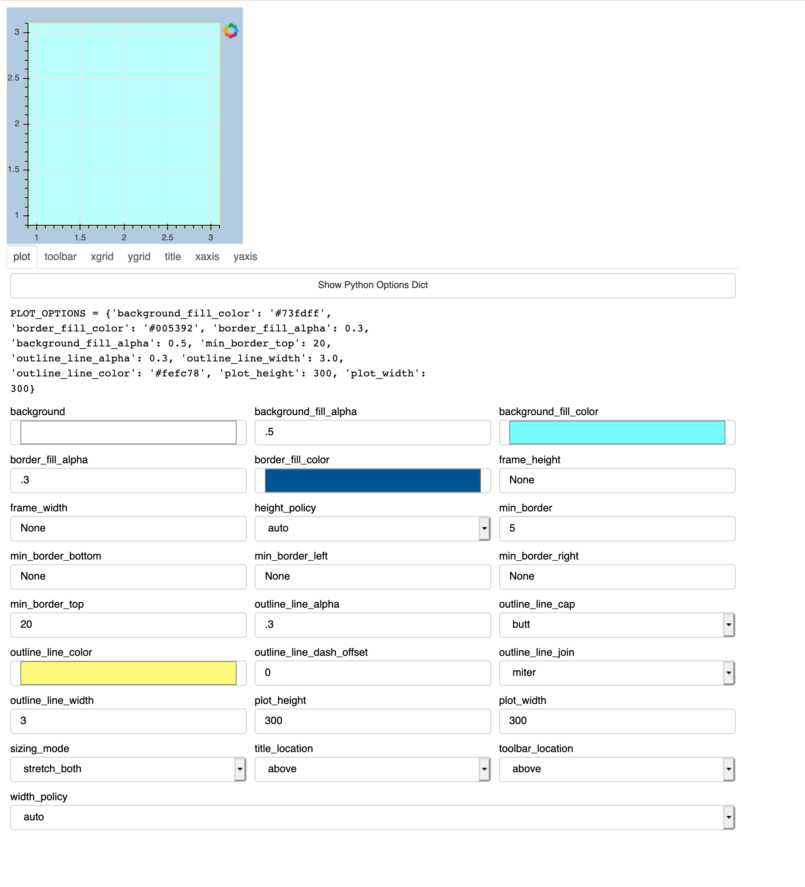

## BokehModelBuilder

<table>
<tr><td></td><td> </td></tr>
</table>

[bokeh](http://bokeh.org) is a library for generating interactive graphics and dashboards in python. 
Every component offers a myriad of customizing options, and I find it impossible to keep track of them.
This tool (very much under development) offers a graphical interface to those options. I imagine the user
working with this tool to prepare a plot format that they like, and then obtaining code from the tool
that they can include in whatever bokeh project they are working on.

To run this preliminary version and see the general idea, download the code and run

```
$ bokeh serve trial.py
```

As yet, you can't output the results!




