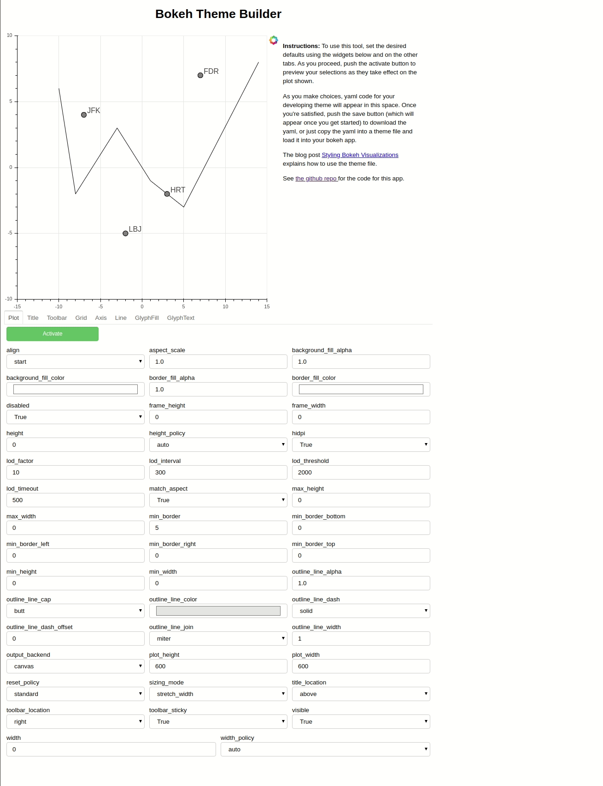

## BokehThemeBuilder


[bokeh](http://bokeh.org) is a library for generating interactive graphics and dashboards in python. 
Every component offers a myriad of customizing options, and I find it impossible to keep track of them.
This tool (very much under development) offers a graphical interface to those options. A user
may prepare a plot format that they like, and then obtain yaml code that they
can include in whatever bokeh project they are working on.

The tool is available as [bokehthemebuilder.herokuapp.com](https://bokehthemebuilder.herokuapp.com)

As you select options,  the page will show yaml code to the right of your plot. 
You can download this yaml code by clicking the download button (creating the file ```theme.yaml```) or just
copy this yaml into a file to create a bokeh theme. [This blog post](https://blog.bokeh.org/posts/styling-bokeh)
explains how to use the theme file to style your plots.

Here is the tool in action:




This [valentines theme](themes/valentines.yaml) is an example created by this tool:

<center>

</center>


You can run this locally as a bokeh server app. 
You run it like this:
```
$ bokeh serve .
```
and navigate in your browser to localhost port 5006.

As a bonus, the utils directory includes the file ```structure.py``` where you can find the ```BokehStructureGraph```
class. This can be used to analyze models and determine which attributes are available for customization.
Using this class on the simple figure


yields this interactive display:


These two images were created in a jupyter notebook using this code:

```
from utils.structure import BokehStructureGraph
from bokeh.plotting import figure, show, output_notebook
output_notebook()
# draw the easy figure
f = figure(height=200,width=200)
f.line(x=[1,2,3],y=[1,2,3])
f.circle(x=[3,2,1],y=[1,2,3],size=10, color='red')
show(f)
# now draw the structure graph with interactive datatable
show(BokehStructureGraph(f).model)
```


